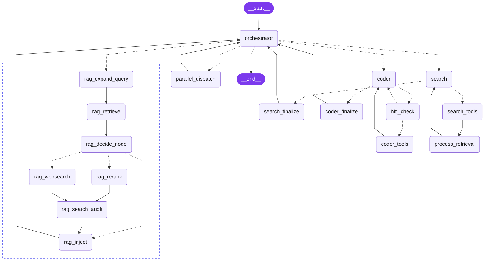

#  Vectora

**Vectora** is an open-source AI assistant (Apache 2.0) built for developers — self-hosted, and designed to run as a powerful sub-agent inside any MCP-compatible orchestrator (Claude Code, Claude Desktop, Paperclip, VS Code extensions).

At its core, Vectora solves the **knowledge gap problem**: LLMs don't know your codebase, your docs, or the latest versions of your stack. Vectora bridges that gap with RAG (Retrieval-Augmented Generation) — ingest your docs once, and every AI interaction becomes contextually aware.

---

## Why Vectora?

- **Orchestrator + Specialized Agents**: The Orchestrator is the primary LLM agent — it answers directly for simple queries and crafts explicit task instructions for specialists (search, coder). No wasted routing hops.
- **RAG-native subgraph**: Every document query goes through a full retrieve → score → rerank → inject pipeline. Results flow back to the Orchestrator for synthesis.
- **16 tools across 5 categories**: Web search, vector search, file system, artifacts, memory — always available across all agents.
- **Cascading embeddings**: Web search results land in an isolated `web_cache` collection and pass a curation gate (Cohere reranker + LLM judge) before being embedded — your curated knowledge base is never contaminated by unreviewed web results.
- **Sub-agent architecture**: Runs as an MCP server. Claude Code delegates complex tasks to Vectora; Vectora reasons, routes, and responds.
- **Persistent memory**: Cross-session memory in SQLite. Vectora remembers your preferences, project context, and decisions.
- **Zero infra**: SQLite + LanceDB. No Docker required for local use.
- **Multi-LLM**: Google Gemini (free tier), Cohere (free tier), OpenAI, Anthropic, or Ollama (fully local).

---

## Architecture

### Orchestrator + Workers

Every message enters through a single entry point and is routed by the **Orchestrator** to the right specialized agent:



| Agent            | Responsibility                                                                       | Tools                                                                          |
| ---------------- | ------------------------------------------------------------------------------------ | ------------------------------------------------------------------------------ |
| **orchestrator** | Primary LLM agent — responds directly OR delegates with an explicit task description | `create_artifact`, `save_memory`, `get_memory`, `delete_memory`                |
| **search**       | Web research, real-time info, builds knowledge base via cascading embeddings         | `web_search`, `fetch_url`, `vector_search`                                     |
| **coder**        | File operations, terminal commands, code generation                                  | `file_read`, `file_edit`, `file_write`, `grep`, `list_dir`, `terminal`         |
| **rag**          | Retrieval pipeline — retrieve → score → rerank/websearch → inject → orchestrator     | `vector_search`, `embedding`, `ingest_docs`, `manage_retriever` (via subgraph) |

### RAG Subgraph

When the orchestrator routes to `rag`, a dedicated subgraph runs the full retrieval pipeline before synthesis:

| Score   | Path                                                           |
| ------- | -------------------------------------------------------------- |
| ≥ 0.7   | `rag_inject` directly — high confidence, no further processing |
| 0.4–0.7 | `rag_rerank` → `rag_search_audit` → `rag_inject`               |
| < 0.4   | `rag_websearch` → `rag_search_audit` → `rag_inject`            |

**`rag_search_audit`** is a mini Search Agent loop (max 3 iterations) that runs after the reranker. It can delete incorrect entries (`manage_retriever`), fetch canonical sources (`fetch_url`), and index them into the dedicated `search` bucket — keeping the knowledge base accurate without user intervention.

Results are injected as a `SystemMessage` into context. The Orchestrator then synthesizes the final answer inline, without a separate agent hop.

### Artifact Tool

Agents explicitly call `create_artifact` to persist structured documents (plans, specs, guides, architecture decisions) to `~/.vectora/artifacts/{session_id}/` as Markdown files. The tool returns structured metadata (path, title, type, session_id, timestamp) that the Orchestrator can reference in future turns.

### Web Content Anti-contamination

After any `web_search` or `fetch_url` call, `process_retrieval` routes results through a curation gate before embedding:

1. **Cohere reranker** scores each candidate against the current query — items below `web_persist_min_score` are discarded.
2. **LLM judge** evaluates survivors against the project context and current task, returning a `keep/discard` verdict per document.

Approved content is embedded into a dedicated `web_cache` collection, isolated from `articles` (user-curated content). The `/rag` panel shows the breakdown per collection, and `manage_retriever` lets you audit or remove cached web content at any time.

---

## Prerequisites

### Cohere — Required

Vectora uses [Cohere](https://cohere.com/) for embeddings (`embed-multilingual-v3.0`) and reranking (`rerank-multilingual-v3.0`). It offers a **generous free tier** with first-class LangChain integration.

Get your key: https://dashboard.cohere.com/api-keys

### Tavily — Required

Vectora uses [Tavily](https://tavily.com/) for real-time web search and URL content extraction. It offers a **generous free tier** optimized for AI agents.

Get your key: https://app.tavily.com/

### LLM Provider — Choose One

| Provider                         | Free Tier | Get Key                                                       |
| -------------------------------- | --------- | ------------------------------------------------------------- |
| **Google Gemini** ✅ Recommended | Yes       | [aistudio.google.com](https://aistudio.google.com/app/apikey) |
| Cohere                           | Yes       | [dashboard.cohere.com](https://dashboard.cohere.com/api-keys) |
| Ollama (local)                   | No cost   | [ollama.ai](https://ollama.ai)                                |
| OpenAI                           | Paid      | [platform.openai.com](https://platform.openai.com/api-keys)   |
| Anthropic                        | Paid      | [console.anthropic.com](https://console.anthropic.com/)       |

---

## Installation

### Option 1: UV — Local install (recommended)

Install Vectora globally with [uv](https://github.com/astral-sh/uv):

```bash
uv tool install vectora-agent
```

On first run, the setup wizard will ask for your API keys and write them to `~/.vectora/.env`.

```bash
vectora        # starts chat (wizard runs automatically if no keys found)
```

To connect Vectora as an MCP sub-agent for Claude Code or Claude Desktop, add to your `.mcp.json`:

```json
{
  "mcpServers": {
    "Vectora": {
      "command": "vectora",
      "args": ["mcp-server"]
    }
  }
}
```

### Option 2: Docker — VPS / remote MCP server

Use this when you want Vectora running on a server and accessible from multiple machines or orchestrators via SSE.

**Local (no domain):**

```bash
cp .env.example .env
# Edit .env with your API keys

docker compose up -d
# SSE endpoint: http://localhost:8000/sse
```

**VPS with Traefik (HTTPS + domain):**

```bash
cp .env.example .env
# Edit .env with your API keys, VECTORA_DOMAIN and ACME_EMAIL

# Create the shared Traefik network if it doesn't exist yet
docker network create traefik-public

docker compose -f docker-compose.yml -f docker-compose.traefik.yml up -d
# SSE endpoint: https://vectora.yourdomain.com/sse
```

To connect from Claude Code or any MCP-compatible orchestrator:

```json
{
  "mcpServers": {
    "Vectora": {
      "url": "https://vectora.yourdomain.com/sse"
    }
  }
}
```

### Option 3: From Source

```bash
git clone https://github.com/brunosrz/vectora.git
cd vectora

uv sync

cp .env.example .env
# Edit .env with your API keys

uv run vectora
```

---

## 🎨 Vectora Chat (Optional)

In addition to the CLI, you can use **Vectora Chat**, a modern web interface for a more visual experience.

- **Installation**: Must be installed on the same host as the Vectora agent.
  ```bash
  pnpm install -g vectora-chat
  ```
- **Usage**: Simply run the following command to start both the web UI and the agent:
  ```bash
  vectora-chat
  ```

---

## CLI Reference

### Agent (Core)

The main entry point for the Vectora CLI is the `vectora` command.

```bash
vectora [command] [options]
```

| Command      | Description                                                       |
| :----------- | :---------------------------------------------------------------- |
| `(default)`  | Starts the interactive chat interface (resumes the last session). |
| `mcp-server` | Starts the MCP server (stdio JSON-RPC) for IDE integration.       |
| `traces`     | Displays internal execution traces from `~/.vectora/traces.db`.   |
| `sessions`   | Lists all saved chat sessions.                                    |
| `config`     | Displays or updates configuration in `~/.vectora/settings.json`.  |

**Global Options:**

- `--model <name>`: Switch the LLM provider/model (e.g., `gemini-3.5-flash`, `command-a-03-2025`).
- `--new`: Forces a fresh conversation session.
- `--session <id>`: Resumes a specific session.
- `--verbosity <0-5>`: Adjusts console output detail level.
- `--quit`: Automatically quits after 10 seconds.

### Chat (Web UI)

The `vectora-chat` command unifies the frontend and the agent backend.

```bash
vectora-chat
```

| Command  | Description                                                   |
| :------- | :------------------------------------------------------------ |
| `/help`  | Shows command menu inside the chat.                           |
| `/new`   | Clears current thread and starts a new session.               |
| `/clear` | Resets the current thread ID.                                 |
| `/model` | Opens the configuration screen to update connection settings. |
| `/rag`   | Shows knowledge base and workspace info.                      |

---

## Tools Reference

16 tools across 5 categories, always available to all agents:

| Category      | Tools                                                                  | Primary Agent         |
| ------------- | ---------------------------------------------------------------------- | --------------------- |
| **Web**       | `web_search`, `fetch_url`                                              | search                |
| **RAG**       | `vector_search`, `embedding`, `ingest_docs`, `manage_retriever`        | search / RAG subgraph |
| **Files**     | `file_read`, `file_edit`, `file_write`, `grep`, `list_dir`, `terminal` | coder                 |
| **Artifacts** | `create_artifact`                                                      | orchestrator          |
| **Memory**    | `save_memory`, `get_memory`, `delete_memory`                           | orchestrator / coder  |

---

## Data & Persistence

All data is stored locally in `~/.vectora/`:

```
~/.vectora/
├── .env                    # API keys (secrets — never commit)
├── settings.json           # Runtime preferences (provider, model, verbosity)
├── data/
│   ├── vectora.db          # Sessions, memories, LangGraph checkpoints (SQLite)
│   ├── embedding_queue.db  # Async embedding queue (SQLite)
│   ├── traces.db           # Internal observability spans (SQLite)
│   └── lancedb/            # Vector store for RAG (LanceDB)
├── artifacts/              # Auto-detected plans, specs, guides
│   └── {session_id}/
│       └── *.md
├── keys/                   # Reserved for future key management
└── logs/
    ├── vectora.jsonl       # Structured JSON logs
    └── session_*.md        # Exported session audit trails
```

**Separation of concerns:**

- `~/.vectora/.env` — secrets (API keys). Never versioned.
- `~/.vectora/settings.json` — non-secret runtime preferences (active provider, model, verbosity, last session per directory). Managed by `vectora config`.

---

## Tech Stack

| Layer            | Technology                                                                                             |
| ---------------- | ------------------------------------------------------------------------------------------------------ |
| Language         | Python 3.14+ managed by [uv](https://github.com/astral-sh/uv)                                          |
| Agent Framework  | [LangChain](https://langchain.com/) + [LangGraph](https://langchain-ai.github.io/langgraph/)           |
| Agent Pattern    | Orchestrator + Specialized Workers (search / coder) + RAG Subgraph                                     |
| Vector Store     | [LanceDB](https://lancedb.github.io/lancedb/) — file-based, zero-config                                |
| Embeddings       | [Cohere](https://cohere.com/) — `embed-multilingual-v3.0` + `rerank-multilingual-v3.0`                 |
| Persistence      | SQLite via `aiosqlite` + LangGraph Checkpointer                                                        |
| Context Protocol | [MCP](https://modelcontextprotocol.io/) via [FastMCP](https://github.com/jlowin/fastmcp)               |
| Terminal UI      | [Rich](https://rich.readthedocs.io/) + [prompt-toolkit](https://python-prompt-toolkit.readthedocs.io/) |
| Observability    | [LangSmith](https://smith.langchain.com/) (optional)                                                   |

---

## Configuration

API keys go in `~/.vectora/.env` (created by the setup wizard) or a project-local `.env`:

```env
# LLM Provider (auto-detected from available keys if not set)
LLM_PROVIDER=google-genai
GOOGLE_API_KEY=your_key_here

# Required: RAG embeddings + reranking
COHERE_API_KEY=your_key_here

# Required: Web search + URL extraction
TAVILY_API_KEY=your_key_here

# Optional: Tracing
LANGSMITH_TRACING=false
LANGSMITH_API_KEY=your_key_here
LANGSMITH_PROJECT=vectora
```

Runtime preferences (model, verbosity, session history) are managed in `~/.vectora/settings.json` via `vectora config` or the `/model` and `/debug` chat commands — no need to touch `.env` for these.

---

## License

Apache 2.0. See [LICENSE](./LICENSE).

<!-- mcp-name: io.github.brunosrz/vectora -->
