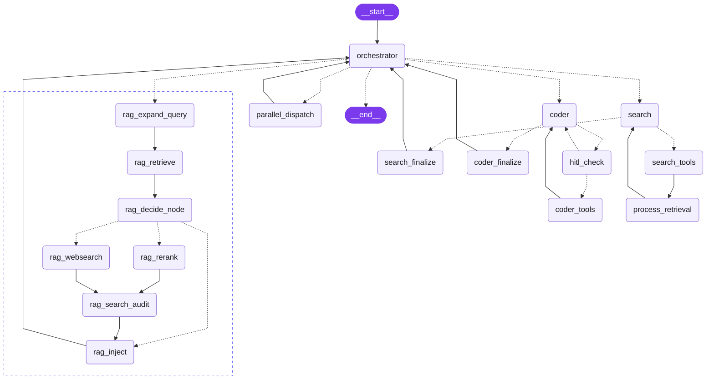

#  Vectora

O **Vectora** é um assistente de IA de código aberto (licença Apache 2.0) desenvolvido especialmente para desenvolvedores. Ele é self-hosted, funcionando perfeitamente como um sub-agente poderoso dentro de qualquer orquestrador compatível com o protocolo MCP (como Claude Code, Claude Desktop, Paperclip e extensões do VS Code).

Em sua essência, o Vectora resolve o **problema do abismo de conhecimento (knowledge gap)**: os LLMs não conhecem sua base de código, sua documentação ou as versões mais recentes das tecnologias da sua stack. O Vectora preenche essa lacuna utilizando RAG (Retrieval-Augmented Generation) — você indexa seus documentos uma única vez e, a partir de então, todas as interações com a IA passam a ter consciência contextual completa.

---

## Por que o Vectora?

- **Orchestrator + Agentes Especializados**: O Orchestrator é o agente LLM primário — responde diretamente para consultas simples e cria instruções explícitas de tarefa para os especialistas (search, coder). Sem hops de roteamento desnecessários.
- **RAG nativo**: Cada consulta a documentos passa por um pipeline completo de retrieve → score → rerank → inject. O resultado flui de volta para o Orchestrator para síntese inline.
- **16 ferramentas integradas**: Busca web, busca vetorial, filesystem, artifacts, memória e ponte MCP — sempre disponíveis.
- **Embeddings curados**: Resultados da busca web passam por um gate de curadoria (reranker Cohere + LLM judge) antes de serem indexados em uma coleção isolada (`web_cache`) — seus docs curados nunca são misturados com conteúdo web não revisado.
- **Arquitetura de sub-agente**: Projetado para rodar como um servidor MCP. O Claude Code pode delegar tarefas complexas para o Vectora, que raciocina, roteia e responde.
- **Memória persistente**: Memória entre sessões armazenada em SQLite. O Vectora lembra das suas preferências, contexto do projeto e decisões anteriores.
- **Infraestrutura zero**: SQLite + LanceDB. Não é necessário Docker para uso local.
- **Suporte a Múltiplos LLMs**: Google Gemini (plano gratuito), Cohere (plano gratuito), OpenAI, Anthropic ou Ollama (execução totalmente local).

---

## Arquitetura

### Orchestrator + Workers

Toda mensagem entra por um único ponto de entrada e é processada pelo **Orchestrator**:



| Agente           | Responsabilidade                                                                       | Ferramentas                                                                    |
| ---------------- | -------------------------------------------------------------------------------------- | ------------------------------------------------------------------------------ |
| **orchestrator** | Agente LLM primário — responde diretamente OU delega com instrução explícita de tarefa | `create_artifact`, `save_memory`, `get_memory`, `delete_memory`                |
| **search**       | Pesquisa web em tempo real, constrói base de conhecimento via embeddings curados       | `web_search`, `fetch_url`, `vector_search`                                     |
| **coder**        | Operações de filesystem, comandos de terminal, geração de código                       | `file_read`, `file_edit`, `file_write`, `grep`, `list_dir`, `terminal`         |
| **rag**          | Pipeline de recuperação — retrieve → score → rerank/websearch → inject → orchestrator  | `vector_search`, `embedding`, `ingest_docs`, `manage_retriever` (via subgrafo) |

### RAG Subgraph

Quando o Orchestrator roteia para `rag`, um subgrafo dedicado executa o pipeline completo de recuperação:

| Score   | Caminho                                                           |
| ------- | ----------------------------------------------------------------- |
| ≥ 0.7   | `rag_inject` direto — alta confiança, sem processamento adicional |
| 0.4–0.7 | `rag_rerank` → `rag_search_audit` → `rag_inject`                  |
| < 0.4   | `rag_websearch` → `rag_search_audit` → `rag_inject`               |

**`rag_search_audit`** é um mini loop do Search Agent (máx 3 iterações) que roda após o reranker. Ele pode apagar entradas incorretas (`manage_retriever`), buscar a fonte canônica (`fetch_url`) e indexá-la no bucket dedicado `search` — mantendo a base de conhecimento precisa sem intervenção do usuário.

Os resultados são injetados como `SystemMessage` no contexto. O Orchestrator então sintetiza a resposta final inline, sem um hop de agente separado.

### Ferramenta de Artifacts

Os agentes chamam explicitamente `create_artifact` para persistir documentos estruturados (planos, specs, guias, decisões de arquitetura) em `~/.vectora/artifacts/{session_id}/` como arquivos Markdown. A ferramenta retorna metadados estruturados (path, title, type, session_id, timestamp) que o Orchestrator pode referenciar em turnos futuros.

### Anti-contaminação do RAG web

Após qualquer chamada de `web_search` ou `fetch_url`, o `process_retrieval` passa os resultados por um gate de curadoria antes de embeddar:

1. **Reranker Cohere** pontua cada candidato contra a query atual — itens abaixo de `web_persist_min_score` são descartados.
2. **LLM judge** avalia os sobreviventes contra o contexto do projeto e a tarefa corrente, retornando um veredicto `keep/discard` por documento.

O conteúdo aprovado é indexado em uma coleção dedicada `web_cache`, isolada da coleção `articles` (conteúdo curado pelo usuário). O painel `/rag` exibe o breakdown por coleção, e a tool `manage_retriever` permite auditar ou remover conteúdo web em cache a qualquer momento.

---

## Pré-requisitos

### Cohere — Obrigatório

O Vectora utiliza a [Cohere](https://cohere.com/) para embeddings (`embed-multilingual-v3.0`) e reranking (`rerank-multilingual-v3.0`). O serviço oferece um **plano gratuito bastante generoso** com suporte multilíngue de primeira classe (português incluso).

Obtenha sua chave de API: https://dashboard.cohere.com/api-keys

### Tavily — Obrigatório

O Vectora utiliza o [Tavily](https://tavily.com/) para busca web em tempo real e extração de conteúdo de URLs, otimizado para agentes de IA. O serviço oferece um **plano gratuito** com cotas generosas.

Obtenha sua chave de API: https://app.tavily.com/

### Provedor de LLM — Escolha Um

| Provedor                         | Plano Gratuito | Obter Chave                                                   |
| -------------------------------- | -------------- | ------------------------------------------------------------- |
| **Google Gemini** ✅ Recomendado | Sim            | [aistudio.google.com](https://aistudio.google.com/app/apikey) |
| Cohere                           | Sim            | [dashboard.cohere.com](https://dashboard.cohere.com/api-keys) |
| Ollama (local)                   | Sem custo      | [ollama.ai](https://ollama.ai)                                |
| OpenAI                           | Pago           | [platform.openai.com](https://platform.openai.com/api-keys)   |
| Anthropic                        | Pago           | [console.anthropic.com](https://console.anthropic.com/)       |

---

## Instalação

### Opção 1: UV — Instalação local (recomendado)

Instale o Vectora globalmente com o [uv](https://github.com/astral-sh/uv):

```bash
uv tool install vectora-agent
```

Na primeira execução, o assistente de configuração pedirá suas chaves de API e as gravará em `~/.vectora/.env`.

```bash
vectora        # inicia o chat (o wizard roda automaticamente se não houver chaves)
```

Para conectar o Vectora como sub-agente MCP no Claude Code ou Claude Desktop, adicione ao seu `.mcp.json`:

```json
{
  "mcpServers": {
    "Vectora": {
      "command": "vectora",
      "args": ["mcp-server"]
    }
  }
}
```

### Opção 2: Docker — VPS / servidor MCP remoto

Use quando quiser o Vectora rodando em um servidor e acessível de múltiplas máquinas ou orquestradores via SSE.

**Local (sem domínio):**

```bash
cp .env.example .env
# Edite o .env com suas chaves de API

docker compose up -d
# Endpoint SSE: http://localhost:8000/sse
```

**VPS com Traefik (HTTPS + domínio):**

```bash
cp .env.example .env
# Edite o .env com suas chaves, VECTORA_DOMAIN e ACME_EMAIL

# Crie a rede compartilhada do Traefik (se ainda não existir)
docker network create traefik-public

docker compose -f docker-compose.yml -f docker-compose.traefik.yml up -d
# Endpoint SSE: https://vectora.seudominio.com/sse
```

Para conectar do Claude Code ou qualquer orquestrador MCP:

```json
{
  "mcpServers": {
    "Vectora": {
      "url": "https://vectora.seudominio.com/sse"
    }
  }
}
```

### Opção 3: A partir do Código Fonte

```bash
git clone https://github.com/brunosrz/vectora.git
cd vectora

uv sync

cp .env.example .env
# Edite o .env com suas chaves de API

uv run vectora
```

---

## 🎨 Vectora Chat (Opcional)

Além do CLI, você pode usar o **Vectora Chat**, uma interface web moderna para uma experiência mais visual.

- **Instalação**: Deve ser instalado na mesma máquina que o agente Vectora.
  ```bash
  pnpm install -g vectora-chat
  ```
- **Uso**: Basta rodar o comando abaixo para iniciar tanto a interface web quanto o agente:
  ```bash
  vectora-chat
  ```

---

## Referência de CLI

### Agente (Core)

O ponto de entrada principal para o CLI do Vectora é o comando `vectora`.

```bash
vectora [comando] [opções]
```

| Comando      | Descrição                                                               |
| :----------- | :---------------------------------------------------------------------- |
| `(padrão)`   | Inicia a interface de chat interativa (retoma a última sessão).         |
| `mcp-server` | Inicia o servidor MCP (stdio JSON-RPC) para integração com IDEs.        |
| `traces`     | Exibe os rastros internos de observabilidade de `~/.vectora/traces.db`. |
| `sessions`   | Lista todas as sessões de chat salvas.                                  |
| `config`     | Exibe ou atualiza a configuração em `~/.vectora/settings.json`.         |

**Opções Globais:**

- `--model <nome>`: Altera o provedor/modelo de LLM (ex: `gemini-3.5-flash`, `command-a-03-2025`).
- `--new`: Força uma nova sessão de conversa.
- `--session <id>`: Retoma uma sessão específica.
- `--verbosity <0-5>`: Ajusta o nível de detalhe da saída no console.
- `--quit`: Encerra automaticamente após 10 segundos.

### Chat (Web UI)

O comando `vectora-chat` unifica o frontend e o backend do agente.

```bash
vectora-chat
```

| Comando  | Descrição                                                            |
| :------- | :------------------------------------------------------------------- |
| `/help`  | Exibe o menu de comandos dentro do chat.                             |
| `/new`   | Limpa a thread atual e inicia uma nova sessão.                       |
| `/clear` | Reinicia o ID da thread atual.                                       |
| `/model` | Abre a tela de configuração para atualizar as definições de conexão. |
| `/rag`   | Exibe informações sobre a base de conhecimento e workspace.          |

---

## Referência de Ferramentas

16 ferramentas em 5 categorias, sempre disponíveis para todos os agentes:

| Categoria     | Ferramentas                                                            | Agente Principal      |
| ------------- | ---------------------------------------------------------------------- | --------------------- |
| **Web**       | `web_search`, `fetch_url`                                              | search                |
| **RAG**       | `vector_search`, `embedding`, `ingest_docs`, `manage_retriever`        | search / RAG subgraph |
| **Arquivos**  | `file_read`, `file_edit`, `file_write`, `grep`, `list_dir`, `terminal` | coder                 |
| **Artifacts** | `create_artifact`                                                      | orchestrator          |
| **Memória**   | `save_memory`, `get_memory`, `delete_memory`                           | orchestrator / coder  |

---

## Dados e Persistência

Todos os dados são armazenados localmente em `~/.vectora/`:

```
~/.vectora/
├── .env                    # Chaves de API (segredos — nunca versionar)
├── settings.json           # Preferências de runtime (provider, model, verbosidade)
├── data/
│   ├── vectora.db          # Sessões, memórias, checkpoints do LangGraph (SQLite)
│   ├── embedding_queue.db  # Fila assíncrona de embeddings (SQLite)
│   ├── traces.db           # Spans de observabilidade interna (SQLite)
│   └── lancedb/            # Banco de dados vetorial para RAG (LanceDB)
├── artifacts/              # Planos, specs e guias criados via create_artifact
│   └── {session_id}/
│       └── *.md
├── keys/                   # Reservado para gerenciamento futuro de chaves
└── logs/
    ├── vectora.jsonl       # Logs estruturados em JSON
    └── session_*.md        # Trilhas de auditoria de sessão exportadas
```

**Separação de responsabilidades:**

- `~/.vectora/.env` — segredos (chaves de API). Nunca versionar.
- `~/.vectora/settings.json` — preferências de runtime não-secretas (provider ativo, model, verbosidade, última sessão por diretório). Gerenciado pelo `vectora config`.

---

## Stack de Tecnologia

| Camada             | Tecnologia                                                                                             |
| ------------------ | ------------------------------------------------------------------------------------------------------ |
| Linguagem          | Python 3.14+ gerenciado pelo [uv](https://github.com/astral-sh/uv)                                     |
| Framework de Agent | [LangChain](https://langchain.com/) + [LangGraph](https://langchain-ai.github.io/langgraph/)           |
| Padrão de Agente   | Orchestrator + Workers Especializados (search / coder) + RAG Subgraph                                  |
| Banco Vetorial     | [LanceDB](https://lancedb.github.io/lancedb/) — baseado em arquivos, configuração zero                 |
| Embeddings         | [Cohere](https://cohere.com/) — `embed-multilingual-v3.0` + `rerank-multilingual-v3.0`                 |
| Persistência       | SQLite via `aiosqlite` + Checkpointer do LangGraph                                                     |
| Protocolo Contexto | [MCP](https://modelcontextprotocol.io/) via [FastMCP](https://github.com/jlowin/fastmcp)               |
| Interface Terminal | [Rich](https://rich.readthedocs.io/) + [prompt-toolkit](https://python-prompt-toolkit.readthedocs.io/) |
| Observabilidade    | [LangSmith](https://smith.langchain.com/) (opcional)                                                   |

---

## Configuração

Chaves de API vão em `~/.vectora/.env` (criado pelo assistente de configuração) ou em um `.env` local do projeto:

```env
# Provedor de LLM (detectado automaticamente pelas chaves disponíveis se não definido)
LLM_PROVIDER=google-genai
GOOGLE_API_KEY=sua_chave_aqui

# Obrigatório: embeddings e reranking RAG
COHERE_API_KEY=sua_chave_aqui

# Obrigatório: busca web e extração de URLs
TAVILY_API_KEY=sua_chave_aqui

# Opcional: Rastreamento
LANGSMITH_TRACING=false
LANGSMITH_API_KEY=sua_chave_aqui
LANGSMITH_PROJECT=vectora
```

Preferências de runtime (model, verbosidade, histórico de sessões) são gerenciadas em `~/.vectora/settings.json` via `vectora config` ou pelos comandos `/model` e `/debug` dentro do chat — não é necessário editar o `.env` para isso.

---

## Licença

Apache 2.0. Consulte o arquivo [LICENSE](./LICENSE).
